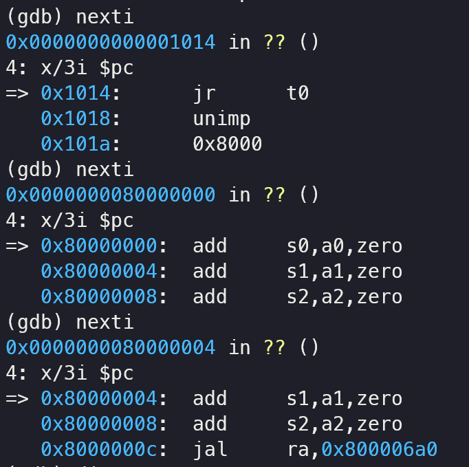

<center>
    姓名: 孟俊邑 <br>
    学号：3190106104 <br>
    学院： 计算机科学与技术学院 <br>
</center>

# Lab 0: GDB + QEMU 调试 64 位 RISC-V LINUX

## 实验步骤

**本人在Windows环境下使用docker desktop（WSL2作为backend）以及manjaro distribution的实体机上使用yay包管理软件安装docker，均配置好了环境，通过实验0的编译和调试，下面以Windows环境为例。**

### 搭建docker环境

#### docker安装

从https://www.docker.com/下载安装包即可，进行正常的安装流程，需要注意的是，再开启WSL2的情况下，默认就将WSL2作为backend，未开启时docker installer需要安装virtual box，猜测其原理是创建一个虚拟机，再在虚拟机中运行Linux版的docker。而在开启WSL2的情况下


docker会自动创建2个发行版，其数据都在WSL发行版中，或许直接在WSL2的某个distribution中安装docker也能取得一样的效果（有同学尝试成功）。

#### 导入镜像

```shell
# 导入docker镜像 
$ cat oslab.tar | docker import - oslab:2021
```

这句指令使用的是管道命令操作符"|"，将cat指令的输出信息作为docker指令的输入，我在Windows环境下使用的shell为pwsh，不支持cat指令和管道命令操作符，经过查阅文档可知，docker import的一种使用格式为：

```
docker import filename repository:tag
```

因此，只需要执行

```shell
docker import .\oslab.tar oslab:2021
```

即可将镜像导入


查看docker镜像的指令与Linux下相同

```shell
$ docker images
REPOSITORY   TAG       IMAGE ID       CREATED        SIZE
oslab        latest    b2b39a3bcd81   404 days ago   3.62GB
```


即可看见镜像已经被导入

#### 创建容器

```shell
# 从镜像创建一个容器
$ docker run --name oslab -it oslab:2021 bash   
# --name:容器名称 -i:交互式操作 -t:终端
root@132a140bd724:/#                            
# 提示符变为 '#' 表明成功进入容器 后面的字符串根据容器而生成，为容器id
root@132a140bd724:/# exit (or CTRL+D)           
# 从容器中退出 此时运行docker ps，运行容器的列表为空
```

`docker run`指创建一个新的容器并运行一个命令，`-it`指交互模式，`oslab:2020`以repository:tag的形式指定了所使用的镜像（使用Image ID的哈希值也可以），`/bin/bash`指在容器内执行`/bin/bash`命令。

这里的root@132a140bd724中132a140bd724是host name，默认情况下，将容器的ID作为host name，为了避免这个冗长的主机名，我加入了-h参数，指定主机名。

```bash
docker run --name oslab -h oslab -it oslab:2021 bash
```


此时已经可以使用bash这个shell与docker容器进行交互。


退出后容器处于停止状态，使用`docker ps -a`可以看见其STATUS为Exited。

*(这里我在docker容器中配置好了zsh和一些工具链，commit到镜像之后使用docker file将其再打包，将默认command更改为了zsh)*

再次进入前需要先将其start起来，然后使用`docker exec`指令进入交互式shell。


#### 挂载目录

```shell
# 挂载本地目录
# 把用户的 home 目录映射到 docker 镜像内的 have-fun-debugging 目录
$ docker run --name oslab -it -v ${HOME}:/have-fun-debugging oslab:2021 bash    # -v 本地目录:容器内目录
```
在使用docker run指令创建容器时，可以使用-v参数指定一个目录映射，这里的`${HOME}`是Linux shell的一个环境变量，实际上就是`/home/user_name`这个目录
```shell
mjy@DESKTOP-HABUS7V:/mnt/d/IDM$ echo ${HOME}
/home/mjy
```
docker for Windows也提供了目录映射的功能，我尝试了将某个Windows NTFS的目录映射到/have-fun-debugging文件夹中，但是这样的做法会导致权限管理的混乱和一些命名冲突，最后弃用了这个方案，直接使用docker容器类的目录而不是用共享文件夹。

```shell
docker run --name oslab -h oslab -it -v 'F:\OneDrive - zju.edu.cn\ZJUer\OS\Code:/have-fun-debugging' o
slab:2021 zsh
```

***PS:***

一个典型的问题就是Windows对于文件命名的限制，在Windows系统下不能命名AUX开头的文件，而在Linux源码中则存在AUX.c，AUX.h的文件，在容器内使用共享文件夹，wget源码压缩包并解压会导致在Windows下无法删除和查看，只能通过docker容器或者wsl删除。


如果尝试删除wsl创建的aux.c，则会提示aux.c过大，此时只能通过wsl执行`rm aux.c`去删除。


### 获取 Linux 源码和已经编译好的文件系统

#### 获取源码并解压

（在做实验的时候， [https://www.kernel.org](https://www.kernel.org/) 上最新版为5.14.3，写报告时就更到5.14.7了，还是以做实验的操作为准）

```shell
# 下载源码压缩包
wget https://cdn.kernel.org/pub/linux/kernel/v5.x/linux-5.14.3.tar.xz
# 解压压缩包
tar -xvf linux-5.14.3.tar.xz
```


执行`ls`，可以看见解压出的源码文件夹为linux-5.14.3

#### 编译内核

```shell
make ARCH=riscv CROSS_COMPILE=riscv64-unknown-linux-gnu- defconfig
```

ARCH指定架构为riscv，CROSS_COMPILE指定使用的交叉编译器


defconfig实际利用的文件在`arch/riscv/configs/`下，def即default的意思，根据默认config进行配置。


```shell
make ARCH=riscv CROSS_COMPILE=riscv64-unknown-linux-gnu- -j$(nproc)
```

`$(nproc)`指的是当前CPU的线程数

这里我们需要先返回`/home/linux-5.14.3`目录，使用Make指令对于位于源代码根目录的顶级`Makefile`进行编译。


### 使用QEMU运行内核

```shell
qemu-system-riscv64 -nographic -machine virt -kernel ../../../linux-5.14.3/arch/riscv/boot/Image -device virtio-blk-device,drive=hd0 -append "root=/dev/vda ro console=ttyS0" -bios default -drive file=rootfs.img,format=raw,id=hd0
```


登入shell后可以使用`uname -a`查看到系统内核信息


### 使用 GDB 对内核进行调试

#### 运行内核

```shell
qemu-system-riscv64 -nographic -machine virt -kernel /home/OS/linux-5.14.3/arch/riscv/boot/Image -device virtio-blk-device,drive=hd0 -append "root=/dev/vda ro console=ttyS0" -bios default -drive file=/home/OS/os2021fall/src/lab0/rootfs.img,format=raw,id=hd0 -S -s
```

这里加入-S和-s参数，在启动时暂停CPU执行，并开启tcp:1234端口链接gdb进行调试。

#### 调试内核

```shell
riscv64-unknown-linux-gnu-gdb /home/OS/linux-5.14.3/vmlinux
(gdb) target remote:1234
# target remote 使用1234端口号进行远程调试
(gdb) b start_kernel
# 设置断点
(gdb) continue
```


运行continue后，bootloader启动并将内核载入内存，直到运行到start_kernel函数中断。


再次运行continue，即正常启动内核并进入系统。

### 思考题

#### 1


编写hello.c，一个最简单的hello world程序，然后使用riscv-unknown-elf-gcc将其编译链接为RISC v架构的可执行文件。

#### 2

```shell
riscv64-unknown-elf-objdump -d hello > hello.asm
cat hello.asm | grep -A 20 main
```


#### 3

1. 在 GDB 中查看汇编代码

   

   查看汇编代码的方法有几种，例如`layout asm` 将切换到gdb的组装布局，显示汇编代码，可以使用display/xi reg/address, 设置自动显示某个寄存器或地址附近的指令，每次单步调试时都会显示显示对应的汇编代码，也可以使用disass start_loc, end_loc，反汇编某一个范围内的二进制。

   

2. 在 0x80000000 处下断点

   ```shell
   b * 0x80000000
   ```

3. 查看所有已下的断点

   ```
    info breakpoints
   ```

4. 在 0x80200000 处下断点

   ```
   b * 0x80200000
   ```

5. 清除 0x80000000 处的断点

   ```
   delete 1
   ```

6. 继续运行直到触发 0x80200000 处的断点

   ```
   continue
   ```

   

7. 单步调试一次

   由于调试vmlinux是没有源码的，因此我们只能使用nexti，stepi进行调试（简写为ni，si）

   

8. 退出 QEMU

   聚焦到qemu窗口，按ctrl+a，松开后按X即可退出。

   

#### 4 

cd到linux内核代码顶层目录，使用`make clean`指令清除构建产物


#### 5

使用`file`查看两文件可知：


vmlinux是elf文件，还带有符号表和映射信息，可用于调试，不能直接用bootloader引导。

Image是vmlinux经过objcopy和gzip处理，产生的可引导，压缩的内核，属于vmlinuz的一种。

