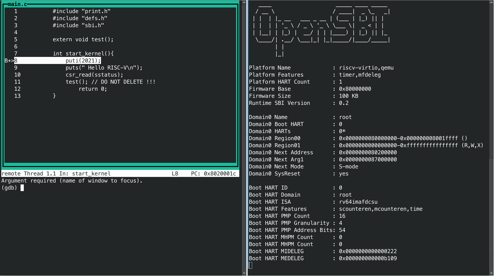
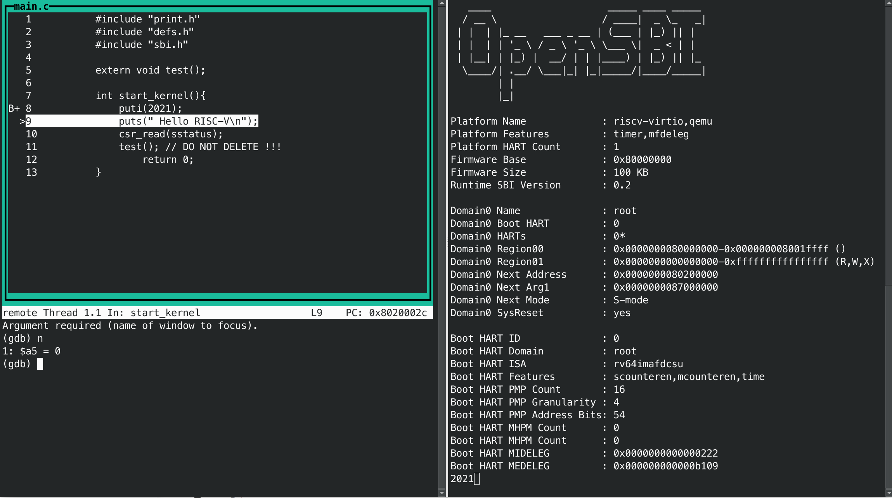
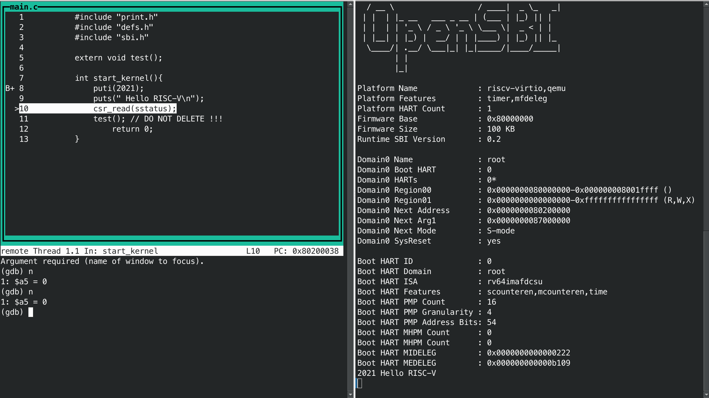
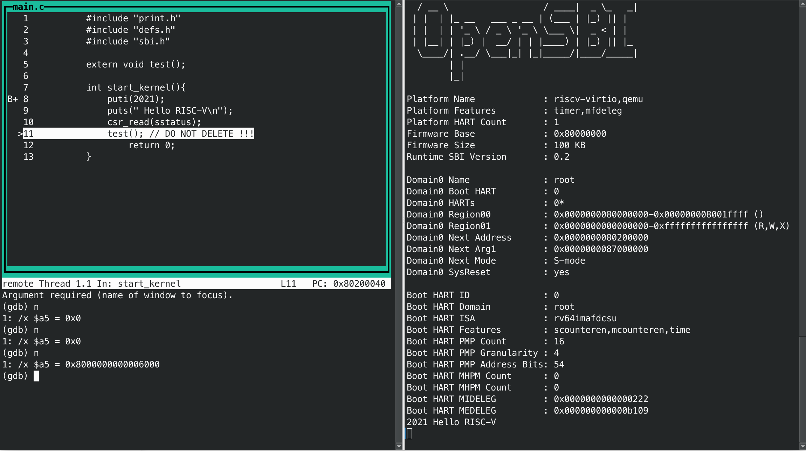
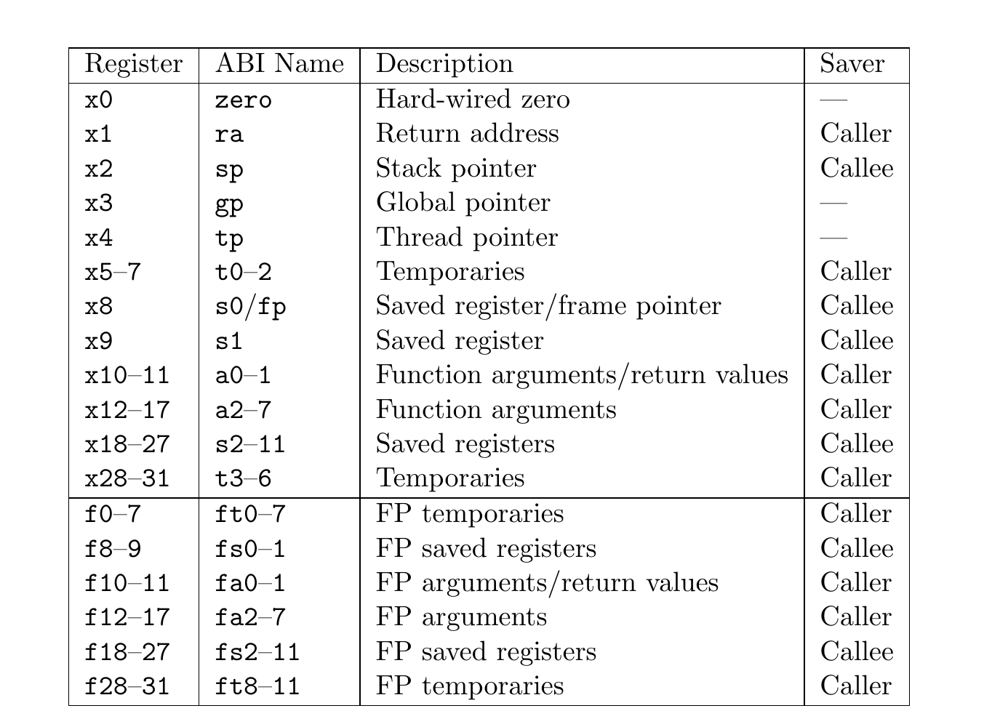

<center>
    姓名: 孟俊邑 <br>
    学号：3190106104 <br>
    学院： 计算机科学与技术学院 <br>
</center>
# Lab 2: RV64 时钟中断处理

## 实验步骤

### 1 准备工程

本人将实验资料和代码上传到github的private repo，添加os21fall作为submodule即可同步获取代码。

```bash
git submodule add https://gitee.com/zjusec/os21fall.git
```

### 2 编写head.S

```assembly
.extern start_kernel
    .section .text.entry
    .globl _start
_start:
    la sp, boot_stack_top
    jal start_kernel
    .section .bss.stack
    .globl boot_stack
boot_stack:
    .space 4096 
    .globl boot_stack_top
boot_stack_top:
```

` .space 4096 ` 在_start后添加0x2000个byte的空间，

` la sp, boot_stack_top`将sp寄存器的值设置为boot_stack_top的地址，也就是_start后0x2000个byte的位置。

设置好了kernel space的栈，执行`jal start_kernel`到start_kernel的位置接着执行。

### 3 完善 Makefile 脚本

```makefile
C_SRC       = $(sort $(wildcard *.c))
OBJ		    = $(patsubst %.c,%.o,$(C_SRC))

file = print.o
all:$(OBJ)
	
%.o:%.c
	${GCC} ${CFLAG} -c $<
clean:
	$(shell rm *.o 2>/dev/null)
```

### 4 补充 `sbi.c`

在我的实现中，改变了参数传递的顺序：

```C
struct sbiret sbi_ecall(uint64 arg0,
			            uint64 arg1, uint64 arg2,
			            uint64 arg3, uint64 arg4,
			            uint64 arg5, int fid, int ext);
```

这里我改变了`sbi_ecall`的参数顺序，这是因为按照ABI（Application Binary Interface）定义的函数参数传递规则，RISC-V架构下优先使用寄存器进行参数传递，其次是使用栈进行传递，此函数需要的8个参数，需要通过`a0-a7`八个寄存器传递。

如：

```C
struct sbiret sbi_ecall(int ext, int fid, uint64 arg0,
                        uint64 arg1, uint64 arg2,
                        uint64 arg3, uint64 arg4,
                        uint64 arg5);
```

```C
void putchar(char c){
    sbi_ecall(SBI_PUTCHAR, 0x0, c, 0, 0, 0, 0, 0);
}
```

objdump后的汇编代码（开启-O3编译）

```assembly
0000000000000000 <putchar>:
   0:   00050613                mv      a2,a0
   4:   00000893                li      a7,0
   8:   00000813                li      a6,0
   c:   00000793                li      a5,0
  10:   00000713                li      a4,0
  14:   00000693                li      a3,0
  18:   00000593                li      a1,0
  1c:   00100513                li      a0,1

0000000000000020 <.LVL1>:
  20:   00000317                auipc   t1,0x0
  24:   00030067                jr      t1 # 20 <.LVL1>
```

注：`char c`这个参数也是通过寄存器传递的，putchar()的caller设置a0 =  char c.

如果我们不调整参数的顺序，那么使用内联汇编时首先不能将参数绑定在寄存器上

```assembly
__asm__ volatile (
"mv a7, %[ext]\n"
"mv a6, %[fid]\n"
"mv a0, %[arg0]\n"
"mv a1, %[arg1]\n"
"mv a2, %[arg2]\n"
"mv a3, %[arg3]\n"
"mv a4, %[arg4]\n"
"mv a5, %[arg5]\n"
"ecall\n"
"mv %[error], a0\n"
"mv %[value], a1\n"
: [error] "=r" (ret.error), [value] "=r" (ret.value)
: [ext] "r" (ext), [fid] "r" (fid), [arg0] "r" (arg0), [arg1] "r" (arg1), \
[arg2] "r" (arg2), [arg3] "r" (arg3), [arg4]"r" (arg4), [arg5] "r" (arg5)
);
```

因为编译器会生成如下的汇编代码：

```assembly
0000000000000000 <sbi_ecall>:
   0:   ff010113                addi    sp,sp,-16
   4:   00050893                mv      a7,a0
   8:   00058813                mv      a6,a1
   c:   00060513                mv      a0,a2
  10:   00068593                mv      a1,a3
  14:   00070613                mv      a2,a4
  18:   00078693                mv      a3,a5
  1c:   00080713                mv      a4,a6
  20:   00088793                mv      a5,a7
  24:   00000073                ecall
  28:   00050513                mv      a0,a0
  2c:   00058593                mv      a1,a1

0000000000000030 <.LVL1>:
  30:   01010113                addi    sp,sp,16
  34:   00008067                ret
```

这样会造成寄存器被覆写（如先mv a7,a0,再mv a5,a7，导致a7先被修改，而a5需要的是a7之前的值），导致调用ecall的寄存器值实际上是错误的。

一种解决方法是将参数绑定在内存上，

```c
struct sbiret sbi_ecall(int ext, int fid, uint64 arg0,
                        uint64 arg1, uint64 arg2,
                        uint64 arg3, uint64 arg4,
                        uint64 arg5) 
{
	struct sbiret ret;

    __asm__ volatile (
		"ld a7, %[ext]\n"
		"ld a6, %[fid]\n"
		"ld a0, %[arg0]\n"
		"ld a1, %[arg1]\n"
		"ld a2, %[arg2]\n"
		"ld a3, %[arg3]\n"
		"ld a4, %[arg4]\n"
		"ld a5, %[arg5]\n"

		"ecall\n"
		"mv %[error], a0\n"
		"mv %[value], a1\n"
		: [error] "=r" (ret.error), [value] "=r" (ret.value)
		: [ext] "m" (ext), [fid] "m" (fid), [arg0] "m" (arg0), [arg1] "m" (arg1), \
		[arg2] "m" (arg2), [arg3] "m" (arg3), [arg4]"m" (arg4), [arg5] "m" (arg5)
	);
	return ret;
}

```

将其objdump后可以看见：

```assembly
0000000000000000 <sbi_ecall>:
   0:   fb010113                addi    sp,sp,-80
   4:   02c13823                sd      a2,48(sp)
   8:   02d13423                sd      a3,40(sp)
   c:   02e13023                sd      a4,32(sp)
  10:   00f13c23                sd      a5,24(sp)
  14:   01013823                sd      a6,16(sp)
  18:   01113423                sd      a7,8(sp)
  1c:   02a12e23                sw      a0,60(sp)
  20:   02b12c23                sw      a1,56(sp)
  24:   03c13883                ld      a7,60(sp)
  28:   03813803                ld      a6,56(sp)
  2c:   03013503                ld      a0,48(sp)
  30:   02813583                ld      a1,40(sp)
  34:   02013603                ld      a2,32(sp)
  38:   01813683                ld      a3,24(sp)
  3c:   01013703                ld      a4,16(sp)
  40:   00813783                ld      a5,8(sp)
  44:   00000073                ecall
  48:   00050513                mv      a0,a0
  4c:   00058593                mv      a1,a1

0000000000000050 <.LVL1>:
  50:   05010113                addi    sp,sp,80

0000000000000054 <.LVL2>:
  54:   00008067                ret
```

为了调整参数传递顺序与ecall调用意义的不一致性，编译器将所有的参数压到栈上，再取出到其应该存放的寄存器中，造成了不必要的浪费。

因此，为了正确性和效率的考量，我们可以更改sbi_ecall()的参数传递顺序：

```assembly
struct sbiret sbi_ecall(uint64 arg0,
			            uint64 arg1, uint64 arg2,
			            uint64 arg3, uint64 arg4,
			            uint64 arg5, int fid, int ext);
{
	struct sbiret ret;
    __asm__ volatile (
		"ecall\n"
		: [error] "=r" (ret.error), [value] "=r" (ret.value)
    );
	return ret;
}

```

这样我们仅仅需要直接调用ecall就可以完成调用OpenSBI接口的功能，同时根据calling convention，a0即为ret.error, a1为ret.value, 因此之前编写的

```assembly
"mv %[error], a0\n"
"mv %[value], a1\n"
```

其实是多余的，只需要申明将其绑定在寄存器上即可。

### 5 `puts()` 和 `puti()`

```C
void putchar(char c){
    sbi_ecall(c, 0, 0, 0, 0, 0, 0, SBI_PUTCHAR);
}

void puts(char *s) {
    while(*s!=0){
        putchar(*s);
        s++;
    }
}

void puti(int x) {
    if(x < 0){
        putchar('-');
        x *= -1;
    }
    char buf[20];
    int loc = 0;
    while(x > 0){
        buf[loc++] = x%10 + '0';
        x /= 10;
    }
    while(loc > 0){
        putchar(buf[--loc]);
    }
}

```

### 6 修改 defs

```c++
#define csr_read(csr)                       \
({                                          \
    register uint64 __v;                    \
    asm volatile ("csrr %0," #csr         \
                    : : "r" (__v)           \
                 );                         \
    __v;                                    \
})
```

## 实验效果

`main.c`:

```
int start_kernel(){
    puti(2021);
    puts(" Hello RISC-V\n");
    csr_read(sstatus);
    test(); // DO NOT DELETE !!!
	return 0;
}
```

`main.o`:

```assembly
0000000000000000 <start_kernel>:
   0:   ff010113                addi    sp,sp,-16
   4:   7e500513                li      a0,2021
   8:   00113423                sd      ra,8(sp)
   c:   00000097                auipc   ra,0x0
  10:   000080e7                jalr    ra # c <start_kernel+0xc> puti()

0000000000000014 <.LVL0>:
  14:   00000517                auipc   a0,0x0
  18:   00050513                mv      a0,a0
  1c:   00000097                auipc   ra,0x0
  20:   000080e7                jalr    ra # 1c <.LVL0+0x8> puts()

0000000000000024 <.LBB2>:
  24:   00000793                li      a5,0
  28:   100027f3                csrr    a5,sstatus # csrread()

000000000000002c <.LBE2>:
  2c:   00000097                auipc   ra,0x0
  30:   000080e7                jalr    ra # 2c <.LBE2> test()

0000000000000034 <.LVL2>:
  34:   00813083                ld      ra,8(sp)
  38:   00000513                li      a0,0
  3c:   01010113                addi    sp,sp,16
  40:   00008067                ret
```

使用`make debug`进行调试：

打开gdb，设置断点在`start_kernel`:

```bash
(gdb) target remote localhost:1234  
Remote debugging using localhost:1234 
0x0000000000001000 in ?? () 
(gdb) b start_kernel 
Breakpoint 1 at 0x8020001c: file main.c, line 8. 
(gdb) continue
```

为了验证csr_read的效果，我设置了`display /x $a5`



>  单步执行`puti(2021)`



qemu terminal中正确输出了`2021`。

> 单步执行`puts(" Hello RISC-V\n")`



qemu terminal中正确输出了`Hello RISC-V`。

> 单步执行`csr_read(sstatus)`



a5的值被修改为sstatus，结果正确。

## 思考题

### Q1

**Calling Convention:**

The RISC-V calling convention passes arguments in registers when possible. Up to eight integer registers, a0–a7, and up to eight floating-point registers, fa0–fa7, are used for this purpose. 

If the arguments to a function are conceptualized as fields of a C struct, each with pointer alignment, the argument registers are a shadow of the first eight pointer-words of that struct. If argument i < 8 is a floating-point type, it is passed in floating-point register fai; otherwise, it is passed in integer register ai. However, floating-point arguments that are part of unions or array fields of structures are passed in integer registers. Additionally, floating-point arguments to variadic functions (except those that are explicitly named in the parameter list) are passed in integer registers.

Arguments smaller than a pointer-word are passed in the least-significant bits of argument registers. Correspondingly, sub-pointer-word arguments passed on the stack appear in the lower addresses of a pointer-word, since RISC-V has a little-endian memory system.

When primitive arguments twice the size of a pointer-word are passed on the stack, they are naturally aligned. When they are passed in the integer registers, they reside in an aligned even-odd register pair, with the even register holding the least-significant bits. In RV32, for example, the function void foo(int, long long) is passed its first argument in a0 and its second in a2 and a3. Nothing is passed in a1.

Arguments more than twice the size of a pointer-word are passed by reference. The portion of the conceptual struct that is not passed in argument registers is passed on the stack. The stack pointer sp points to the first argument not passed in a register.

Values are returned from functions in integer registers a0 and a1 and floating-point registers fa0 and fa1. Floating-point values are returned in floating-point registers only if they are primitives or members of a struct consisting of only one or two floating-point values. Other return values that fit into two pointer-words are returned in a0 and a1. Larger return values are passed entirely in memory; the caller allocates this memory region and passes a pointer to it as an implicit first parameter to the callee.

In the standard RISC-V calling convention, the stack grows downward and the stack pointer is always kept 16-byte aligned.
In addition to the argument and return value registers, seven integer registers t0–t6 and twelve floating-point registers ft0–ft11 are temporary registers that are volatile across calls and must be saved by the caller if later used. Twelve integer registers s0–s11 and twelve floating-point registers fs0–fs11 are preserved across calls and must be saved by the callee if used. Table below indicates the role of each integer and floating-point register in the calling convention.



**Caller-saved registers** (AKA **volatile** registers, or **call-clobbered**) are used to hold temporary quantities that need not be preserved across calls.

Therefore, if the program wants to restore the value after the procedure call, the caller is responsible for pushing these registers onto the stack or copying them to other locations. However, it is normal for the call to destroy the temporary values in these registers. From the perspective of the callee, your function can freely overwrite these registers without saving/restoring.

**Callee-saved registers** (AKA **non-volatile** registers, or **call-preserved**) are used to hold long-lived values that should be preserved across calls.

When the caller makes a procedure call, it can be expected that these registers will maintain the same value after the callee returns, which makes the callee responsible to save them and restore them before returning to the caller, or not to touch them.

### Q2

```
0000000080200000 A BASE_ADDR
0000000080203000 B _ebss
0000000080202000 R _edata
0000000080203000 B _ekernel
000000008020100f R _erodata
00000000802001a0 T _etext
0000000080202000 B _sbss
0000000080202000 R _sdata
0000000080200000 T _skernel
0000000080201000 R _srodata
0000000080200000 T _start
0000000080200000 T _stext
0000000080202000 B boot_stack
0000000080203000 B boot_stack_top
0000000080200058 T putchar
00000000802000cc T puti
0000000080200078 T puts
000000008020000c T sbi_ecall
0000000080203000 B sbss
000000008020001c T start_kernel
0000000080200054 T test
```

