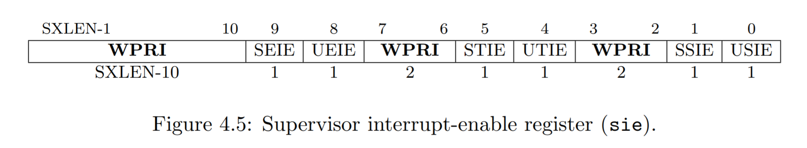
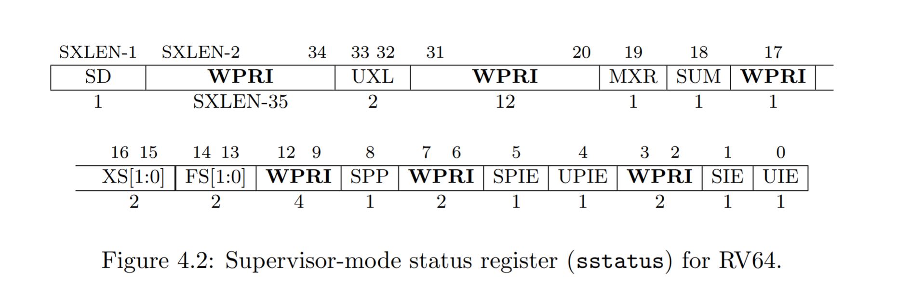
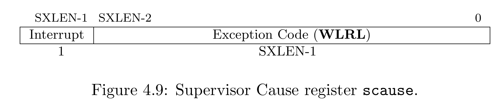
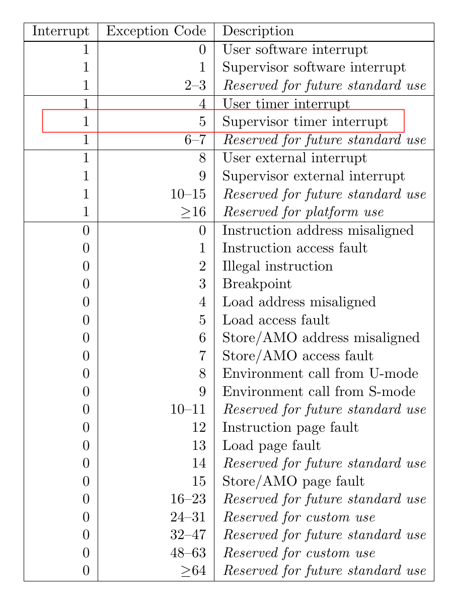
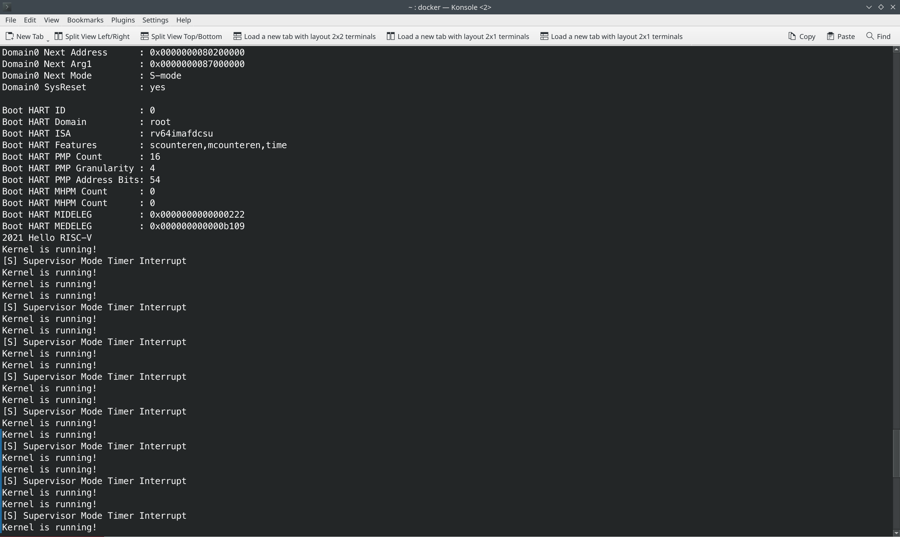
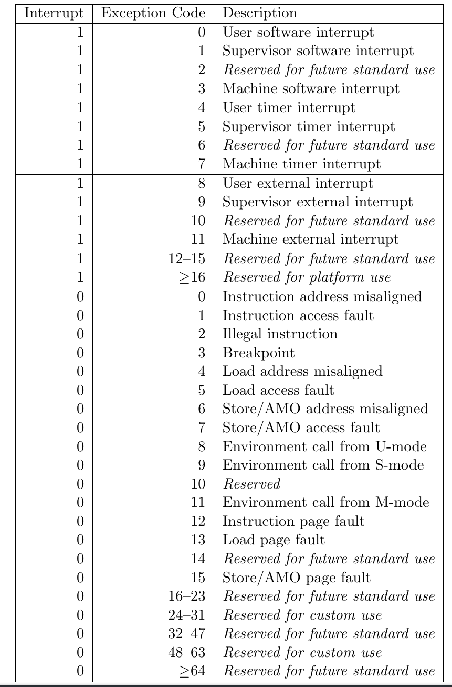

 

<center>
    姓名: 孟俊邑 <br>
    学号：3190106104 <br>
    学院： 计算机科学与技术学院 <br>
</center>

# Lab 2: RV64 时钟中断处理

## 实验步骤

### 1 准备工程

+ 合并代码

在`/home/OS/code`目录下

```bash
cp -r lab1/* lab2 
cp -r ../os21fall/src/lab2/* lab2  
```

将实验一的代码和repo中更新的prink进行合并。

+ 修改 `vmlinux.lds` 以及 `head.S`

```
.text : ALIGN(0x1000){
    _stext = .;

    *(.text.init)      <- 此setcion为_start所在位置
    *(.text.entry)     <- .text.entry为中断程序所在位置
    *(.text .text.*)

    _etext = .;
}
```

```
extern start_kernel

    .section .text.init         <- 将 _start 放入.text.init section 
    .globl _start
_start:

```

### 2 开启异常处理

查阅[RISC-V Privileged Spec](https://github.com/riscv/riscv-isa-manual/releases/download/Ratified-IMFDQC-and-Priv-v1.11/riscv-privileged-20190608.pdf)可知



sie[STIE]为sie寄存器的第6位（从低位到高位，从1开始）



sstatus[SIE]为sstatus寄存器的第2位（从低位到高位，从1开始）

```assembly
# set stvec = _traps
la t0, _traps
csrw stvec, t0
# set sie[STIE] = 1
csrr t0, sie <== 取出sie，暂存在t0
ori t0, t0, 0x20 <== 与0010 0000做或运算,其他位不改变, 仅改变低第六位
csrw sie, t0 <== 写入sie寄存器
# set sstatus[SIE] = 1
csrr t0, sstatus <== 取出sstatus，暂存在t0
ori t0, t0, 0x2 <== 与0010做或运算,其他位不改变, 仅改变低第二位
csrw sstatus, t0 <== 写入status寄存器
```

### 3 实现上下文切换

```assembly
    .section .text.entry
    .align 2
    .globl _traps
_traps:
    # 1. save 32 registers and sepc to stack
    addi sp, sp, -264
    sd x0, 0(sp)
    sd x1, 8(sp)
    sd x2, 16(sp)
    sd x3, 24(sp)
    sd x4, 32(sp)
    sd x5, 40(sp)
    sd x6, 48(sp)
    sd x7, 56(sp)
    sd x8, 64(sp)
    sd x9, 72(sp)
    sd x10, 80(sp)
    sd x11, 88(sp)
    sd x12, 96(sp)
    sd x13, 104(sp)
    sd x14, 112(sp)
    sd x15, 120(sp)
    sd x16, 128(sp)
    sd x17, 136(sp)
    sd x18, 144(sp)
    sd x19, 152(sp)
    sd x20, 160(sp)
    sd x21, 168(sp)
    sd x22, 176(sp)
    sd x23, 184(sp)
    sd x24, 192(sp)
    sd x25, 200(sp)
    sd x26, 208(sp)
    sd x27, 216(sp)
    sd x28, 224(sp)
    sd x29, 232(sp)
    sd x30, 240(sp)
    sd x31, 248(sp)
    csrr t0, sepc
    sd t0, 256(sp)

    # 2. call trap_handler
    csrr a0, scause
    csrr a1, sepc
    call trap_handler

    # 3. restore sepc and 32 registers (x2(sp) should be restore last) from stack
    ld t0, 256(sp)
    csrw sepc, t0
    ld x0, 0(sp)
    ld x1, 8(sp)
    ld x3, 24(sp)
    ld x4, 32(sp)
    ld x5, 40(sp)
    ld x6, 48(sp)
    ld x7, 56(sp)
    ld x8, 64(sp)
    ld x9, 72(sp)
    ld x10, 80(sp)
    ld x11, 88(sp)
    ld x12, 96(sp)
    ld x13, 104(sp)
    ld x14, 112(sp)
    ld x15, 120(sp)
    ld x16, 128(sp)
    ld x17, 136(sp)
    ld x18, 144(sp)
    ld x19, 152(sp)
    ld x20, 160(sp)
    ld x21, 168(sp)
    ld x22, 176(sp)
    ld x23, 184(sp)
    ld x24, 192(sp)
    ld x25, 200(sp)
    ld x26, 208(sp)
    ld x27, 216(sp)
    ld x28, 224(sp)
    ld x29, 232(sp)
    ld x30, 240(sp)
    ld x31, 248(sp)
    ld x2, 16(sp)
    addi sp, sp, 264
    # 4. return from trap
    sret
```

首先将所有寄存器以及sepc压栈, 接着按照calling convention,需要将a0设置为scause, a1设置为sepc, 作为参数传递给trap_handler, trap_handler返回后,  从栈恢复所有寄存器和sepc的值, 最后使用S模式下的ret指令sret返回sepc的位置接着执行。

### 4 实现异常处理函数

查阅[RISC-V Privileged Spec](https://github.com/riscv/riscv-isa-manual/releases/download/Ratified-IMFDQC-and-Priv-v1.11/riscv-privileged-20190608.pdf)可知





发生S模式下的timer interruption之时，Interrupt位置1, Exception Code为5。

```c
void trap_handler(unsigned long scause, unsigned long sepc) {
    unsigned long int_bit = 0x8000000000000000; <== mask
    if(scause & int_bit){ <== 取出最高位，即interrupt位
        switch (scause & ~int_bit){ <== ~int_bit = 0x7FFF FFFF FFFF FFFF
            case 0x5:
                printk("[S] Supervisor Mode Timer Interrupt\n");
                clock_set_next_event();
                break;
            default:
                break;
        }
    }
}
```

### 5 实现时间中断相关函数

```c
#include "sbi.h"
// QEMU中时钟的频率是10MHz, 也就是1秒钟相当于10000000个时钟周期。
unsigned long TIMECLOCK = 10000000;

unsigned long get_cycles() {
    // 使用 rdtime 编写内联汇编，获取 time 寄存器中 (也就是mtime 寄存器 )的值并返回
    unsigned long time;
    __asm__ volatile (
            "rdtime %[time]\n"
            : [time] "=r" (time)
    );
    return time;
}

void clock_set_next_event() {
    // 下一次 时钟中断 的时间点
    unsigned long next = get_cycles() + TIMECLOCK;
    // 使用 sbi_ecall 来完成对下一次时钟中断的设置
    sbi_ecall(next, 0, 0, 0, 0, 0, 0, 0);
} 
```

### 5 编译及测试

修改`test.c`每隔一段时间（0.5s）输出`kernel is running!`,验证上下文切换正确。

```c
#include "printk.h"
#include "defs.h"
#include "clock.h"

void test() {
    unsigned long ptime = get_cycles();
    unsigned long ctime;
    while (1){
        ctime = get_cycles();
        if(ctime - ptime >= 5000000){
            printk("Kernel is running!\n");
            ptime =  ctime;
        }
    };
}
```

## 实验效果



输入`make run`指令，每隔半秒，输出一次`kernel is running`, 每一秒，进入中断一次，并输出`[S] Supervisor Mode Timer Interrupt`

## 思考题

### Q1

medeleg：Machine exception delegation register.

mideleg：Machine interrupt delegation register.

在默认情况下，所有的终端和异常都在M模式下进行处理，尽管可以通过mret返回正确的状态，但出于效率的考虑，可以将trap交给更低权限的模式进行处理，medeleg和mideleg正是起到这样的作用。

通过对这两个寄存器中的某些位置为1，可以将对应exception code的trap交给低特权级进行处理。类似的，S态也有类似的sedeleg sideleg寄存器使得能够将U态的trap交由U态的trap处理程序做。

当trap被授权为x的低级模式时，除mstatus外，高特权寄存器不会发生任何更改，但x寄存器将具有以下操作：
1.xcause写入发生trap的原因
2.xepc写入生成trap的指令的虚拟地址

```
0x0000000000000222
0000 0000 0000 0000 0000 0000 0000 0000 0000 0000 0000 0000 0000 0010 0010 0010
```



mideleg中的第1位，第5位，第9位被置为1，代表将`Supervisor software interrupt`, `Supervisor time interrupt`, `Supervisor external interrupt`交给S态的trap程序做。
