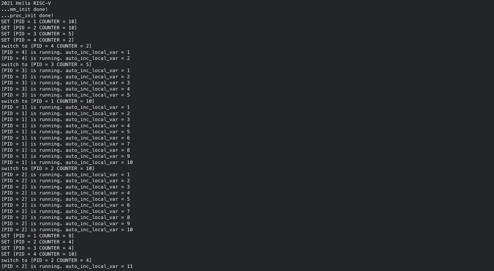
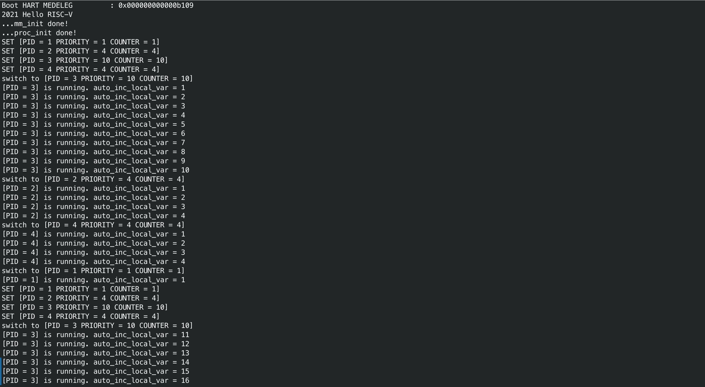

<center>
    姓名: 孟俊邑 <br>
    学号：3190106104 <br>
    学院： 计算机科学与技术学院 <br>
</center>

# Lab 3: RV64 内核线程调度

## 实验步骤

### 4.1 准备工程

1. 同步代码`rand.h/rand.c`, `string.h/string.c`, `mm.h/mm.c`。

   ```
   ├── arch
   │   └── riscv
   │       ├── include
   │       │   └── mm.h
   │       └── kernel
   │           └── mm.c
   ├── include
   │   ├── rand.h
   │   └── string.h
   └── lib
       ├── rand.c
       └── string.c
   ```

2. 更改`defs.h`

   添加以下宏定义：

   ```C
   #define PHY_START 0x0000000080000000
   #define PHY_SIZE  128 * 1024 * 1024 // 128MB， QEMU 默认内存大小
   #define PHY_END   (PHY_START + PHY_SIZE)
   
   #define PGSIZE 0x1000 // 4KB
   #define PGROUNDUP(addr) ((addr + PGSIZE - 1) & (~(PGSIZE - 1)))
   #define PGROUNDDOWN(addr) (addr & (~(PGSIZE - 1)))
   ```

3. 创建`proc.h`和`proc.c`

   ```
   └── arch
       └── riscv
           ├── include
           │   └── proc.h
           └── kernel
               └── proc.c
   
   ```

### 4.2 `proc.h` 数据结构定义

```c
// arch/riscv/include/proc.h

#include "types.h"

#define NR_TASKS  (1 + 31) // 用于控制 最大线程数量 （idle 线程 + 31 内核线程）

#define TASK_RUNNING    0 // 为了简化实验，所有的线程都只有一种状态

#define PRIORITY_MIN 1
#define PRIORITY_MAX 10

/* 用于记录 `线程` 的 `内核栈与用户栈指针` */
/* (lab3中无需考虑，在这里引入是为了之后实验的使用) */
struct thread_info {
    uint64 kernel_sp;
    uint64 user_sp;
};

/* 线程状态段数据结构 */
struct thread_struct {
    uint64 ra;
    uint64 sp;
    uint64 s[12];
};

/* 线程数据结构 */
struct task_struct {
    struct thread_info* thread_info;
    uint64 state;    // 线程状态
    uint64 counter;  // 运行剩余时间
    uint64 priority; // 运行优先级 1最低 10最高
    uint64 pid;      // 线程id

    struct thread_struct thread;
};

/* 线程初始化 创建 NR_TASKS 个线程 */
void task_init();

/* 在时钟中断处理中被调用 用于判断是否需要进行调度 */
void do_timer();

/* 调度程序 选择出下一个运行的线程 */
void schedule();

/* 线程切换入口函数*/
void switch_to(struct task_struct* next);

/* dummy funciton: 一个循环程序，循环输出自己的 pid 以及一个自增的局部变量*/
void dummy();
```

### 4.3 线程调度功能实现

#### 4.3.1 线程初始化

```c
void task_init() {
    idle = (struct task_struct *)kalloc();
    idle -> state = TASK_RUNNING;
    idle -> counter = 0xFFFFFFFFFFFFFFFF;
    idle -> priority = 0;
    idle -> pid = 0;
    current = idle;
    task[0] = idle;


    for(int i = 1; i < NR_TASKS; i++){
        task[i] = (struct task_struct *)kalloc();
        task[i] -> state = TASK_RUNNING;
        task[i] -> counter = 0;
        task[i] -> priority = rand();
        task[i] -> pid = i;
        task[i] -> thread.ra = (uint64)__dummy;
        task[i] -> thread.sp = (uint64)task[i] + PGSIZE;
    }

    printk("...proc_init done!\n");
}
```

在上面的代码中，`kalloc()`函数会为该线程分配一个4KB大小的页，这个线程的`task_struct`在该页最低位置，而其栈空间从内存高处向低处开辟。

这里为了更加方便的实现最短作业优先算法，我设置`idle`的counter为`0xFFFFFFFFFFFFFFFF`，以保证其消耗的时间无论如何都是最大的，若存在`counter`还不为0的线程，则一定会被选择出，所以在`schedule()`将初始查找位置设置为`idle`，再寻找下一个耗时更短的线程。

####  4.3.2 `__dummy` 与 `dummy` 介绍

我们知道，一个线程在执行过程中被时钟中断，进入`do_timer`之前需要在栈上保存其寄存器，但是新创建的线程并没有`store`，如果跳转回`do_timer`之后的下一句语句（也就是返回了`_traps`的`restore`部分），会造成寄存器的值被异常恢复，因此将其PCB中的`ra`设置为`__dummy`，在`__dummy`函数中设置`sepc`为`dummy`，并`sret`从dummy的位置开始执行。

```assembly
// arch/riscv/kernel/entry.S
__dummy:
    la a1, dummy
    csrw sepc, a1
    li a1, 0
    sret
```

#### 4.3.3 实现线程切换

`switch_to`和`__swicth_to`的定义为:

```C
void switch_to(struct task_struct* next);
extern void __switch_to(struct task_struct* prev, struct task_struct* next);
```

通过`switch_to`调用`__swicth_to`

```C
/* 线程切换入口函数*/
void switch_to(struct task_struct * next){
    struct task_struct * prev = current;
    current = next;
    __switch_to(prev, next);
};
```

需要注意是的是 `current = next`这一步必须在调用`__swicth_to`之前完成，因此一旦执行完`__switch_to`，正在执行的代码已经属于另外一个线程了，而他的返回地址正是`switch_to`的下一行，这会造成什么问题呢，下面结合汇编代码进行说明。

一种直观的思路可以这样实现`switch_to`函数：

```C
/* 线程切换入口函数*/
void switch_to(struct task_struct * next){
    __switch_to(current, next);
    current = next;
};
```

看上去逻辑上没有问题的，但将其objdump之后：

```assembly
Disassembly of section .text.switch_to:

0000000000000000 <switch_to>:
   0:   fe010113                addi    sp,sp,-32

0000000000000004 <.LCFI9>:
   4:   00913423                sd      s1,8(sp)
   8:   00000497                auipc   s1,0x0
   c:   00048493                mv      s1,s1
  10:   00813823                sd      s0,16(sp)
  14:   00050413                mv      s0,a0
  18:   0004b503                ld      a0,0(s1) # 8 <.LCFI9+0x4>

000000000000001c <.LVL29>:
  1c:   00040593                mv      a1,s0
  20:   00113c23                sd      ra,24(sp)
  24:   00000097                auipc   ra,0x0
  28:   000080e7                jalr    ra # 24 <.LVL29+0x8>	<------ 此处进入__switch_to()

000000000000002c <.LVL30>:
  2c:   01813083                ld      ra,24(sp)
  30:   0084b023                sd      s0,0(s1)
  34:   01013403                ld      s0,16(sp)

0000000000000038 <.LVL31>:
  38:   00813483                ld      s1,8(sp)
  3c:   02010113                addi    sp,sp,32

0000000000000040 <.LCFI10>:
  40:   00008067                ret
```

上面这段汇编主要涉及的寄存器有`s0`,`s1`,`a0`,`a1`。

在这段汇编中他们分别代表了:

`s0`: `next`这个`task struct`的地址(`next`)

`s1:` `current`这个`task struct *`的地址（`&current`)

`a0`: 根据calling convention，它是传递给子函数的`current`参数

`a1`: 根据calling convention，它是传递给子函数的`next`参数

编译器认为根据calling convention，`__switch_to`不应该修改`s0`,`s1`,因此在从`__switch_to`返回后，执行了 `sd s0,0(s1)`的操作，但`__switch_to`的功能正是恢复另一个线程的寄存器，其中就包括了这两个寄存器，因此逻辑错误。

`__swicth_to`函数体：

```assembly
__switch_to:
    # save state to prev process
    # a0: prev
    # a1: next
    sd ra, 40(a0)
    sd sp, 48(a0)
    sd s1, 56(a0)
    sd s2, 64(a0)
    sd s3, 72(a0)
    sd s4, 80(a0)
    sd s5, 88(a0)
    sd s6, 96(a0)
    sd s7, 104(a0)
    sd s8, 112(a0)
    sd s9, 120(a0)
    sd s10, 128(a0)
    sd s11, 136(a0)
    
    # restore state from next process
    ld ra, 40(a1)
    ld sp, 48(a1)
    ld s1, 56(a1)
    ld s2, 64(a1)
    ld s3, 72(a1)
    ld s4, 80(a1)
    ld s5, 88(a1)
    ld s6, 96(a1)
    ld s7, 104(a1)
    ld s8, 112(a1)
    ld s9, 120(a1)
    ld s10, 128(a1)
    ld s11, 136(a1)
    ret
```


####  4.3.4 实现调度入口函数

```C
/* 在时钟中断处理中被调用 用于判断是否需要进行调度 */
void do_timer(){
    clock_set_next_event();
    if(current == idle){
        schedule();
    }else{
        current -> counter--;
        if(current -> counter <= 0){
            schedule();
        }
    }
};
```

####  4.3.5 实现线程调度

##### 4.3.5.1 短作业优先调度算法

```c
    struct task_struct* next = task[0];
    select:
    for(int i = 1; i < NR_TASKS; i++){
        if(task[i] -> state == TASK_RUNNING){
            if(task[i] -> counter > 0 && task[i] -> counter < next -> counter){
                next = task[i];
            }
        }
    }
    
    /*所有运行状态下的线程运行剩余时间都为0*/
    if(next -> counter == 0xFFFFFFFFFFFFFFFF){
        for(int i = 1; i < NR_TASKS; i++){
            task[i] -> counter = rand();
            printk("SET [PID = %d COUNTER = %d]\n", task[i] -> pid, task[i] -> counter);
        }
        goto select;
    }
    switch_to(next);
```

##### 4.3.5.2 优先级调度算法

```c
    while (1) {
		int c = 0;
        for(int i = 1; i < NR_TASKS; i++){
            if(task[i] -> state == TASK_RUNNING && task[i] -> counter > c){
                next = task[i];
                c = task[i] -> counter;
            }
        }
		if(c) break;
        for(int i = 1; i < NR_TASKS; i++){
            task[i] -> counter = (task[i] -> counter >> 1) + task[i] -> priority;
            printk("SET [PID = %d PRIORITY = %d COUNTER = %d]\n", task[i] -> pid, task[i] -> priority,task[i] -> counter);
        }
	}
    printk("switch to [PID = %d PRIORITY = %d COUNTER = %d]\n", next -> pid, next -> priority, next -> counter);
```

## 实验效果

为了便于观察实验效果，设置`NR_TASKS`为4。

### Shortest Job First



### Priority



## 思考题

### Q1

```
           Process 1         Operating System            Process 2
               +
               |                                            X
 P1 executing  |                                            X
               |                                            X
               v Timer Interrupt Trap                       X
               +---------------------->                     X
                                      +                     X
               X                  do_timer()                X
               X                      +                     X
               X                  schedule()                X
               X                      +                     X
               X              save state to PCB1            X
               X                      +                     X
               X           restore state from PCB2          X
               X                      +                     X
               X                      |                     X
               X                      v Timer Interrupt Ret
               X                      +--------------------->
               X                                            |
               X                                            |  P2 executing
               X                                            |
               X                       Timer Interrupt Trap v
               X                      <---------------------+
               X                      +
               X                  do_timer()
               X                      +
               X                  schedule()
               X                      +
               X              save state to PCB2
               X                      +
               X           restore state from PCB1
               X                      +
               X                      |
                 Timer Interrupt Ret  v
               <----------------------+
               |
 P1 executing  |
               |
               v
```

根据上面的线程切换流程图，实际上 `context_switch`必然是由一次时钟中断引起的，而根据实验二的内容，我们已经在栈上保存了其他的寄存器，因此只需要保存`ra`,`sp`,`s0-s11`即可。

### Q2

`ra` 保存/恢复的函数返回点是`__swicth_to`的下一行，也就是`__traps`的`restore`部分。

因为调用关系如下所示：

```
Interrupt -> __traps(save registers) -> do_timer -> schedule -> switch_to -> __switch_to
```

根据调用约定，进入`__switch_to`之前，将`__swicth_to`的下一行的地址保存在了`ra`中，在开启O3优化的情况下，由于`do_timer`是在函数体末尾调用的`schedule`，`schedule`是在函数体末尾调用的`switch_to`, 编译器将ra设置为了`do_timer`的返回地址，也就是`__traps(restore registers)`的第一行代码。

如果隐藏这些细节，对于这个被`swicth_out`的线程，其执行流程为

```
Interrupt -> __traps(save registers) -> do_timer -> __traps(restore registers) -> sret
```

仿佛只是经历了一次中断流程，而从来没有失去过CPU的使用权。
