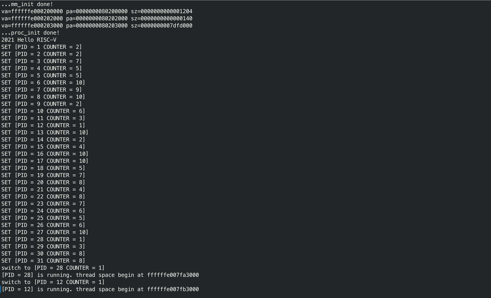
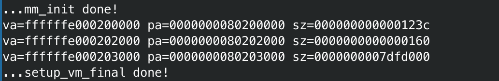
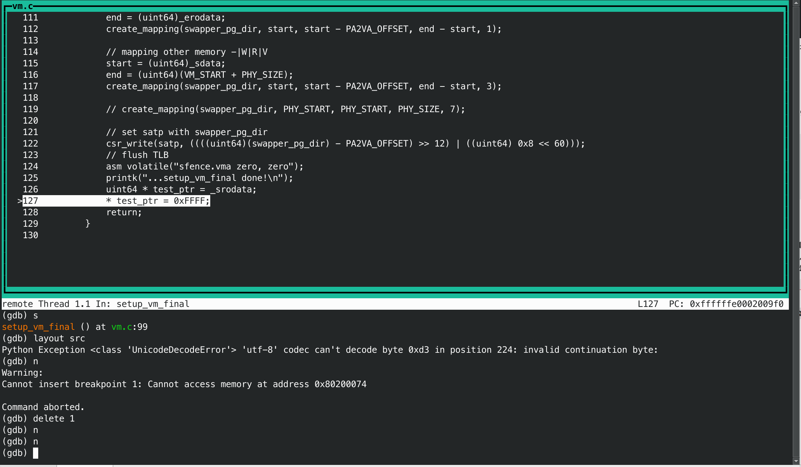
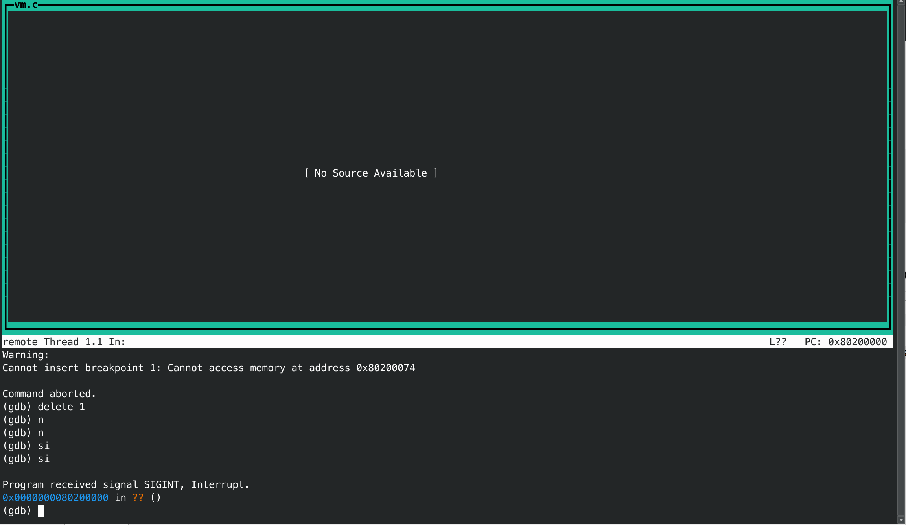

<center>
    姓名: 孟俊邑 <br>
    学号：3190106104 <br>
    学院： 计算机科学与技术学院 <br>
</center>
# Lab 4: RV64 虚拟内存管理

## 实验原理

开启虚拟地址映射主要有以下三步：

1. 正确设置页表
2. 设置satp寄存器
3. flush tlb

### 虚拟地址与物理地址

```c
     38        30 29        21 20        12 11                           0
     ---------------------------------------------------------------------
    |   VPN[2]   |   VPN[1]   |   VPN[0]   |          page offset         |
     ---------------------------------------------------------------------
                            Sv39 virtual address

 55                30 29        21 20        12 11                           0
 -----------------------------------------------------------------------------
|       PPN[2]       |   PPN[1]   |   PPN[0]   |          page offset         |
 -----------------------------------------------------------------------------
                            Sv39 physical address
```

### 页表项结构

```c
 // 页表项结构
 63      54 53        28 27        19 18        10 9   8 7 6 5 4 3 2 1 0
 -----------------------------------------------------------------------
| Reserved |   PPN[2]   |   PPN[1]   |   PPN[0]   | RSW |D|A|G|U|X|W|R|V|
 -----------------------------------------------------------------------
                                                     |   | | | | | | | |
                                                     |   | | | | | | | `---- V - Valid
                                                     |   | | | | | | `------ R - Readable
                                                     |   | | | | | `-------- W - Writable
                                                     |   | | | | `---------- X - Executable
                                                     |   | | | `------------ U - User
                                                     |   | | `-------------- G - Global
                                                     |   | `---------------- A - Accessed
                                                     |   `------------------ D - Dirty (0 in page directory)
                                                     `---------------------- Reserved for supervisor software
```

|  X   |  W   |  R   | Meaning                              |
| :--: | :--: | :--: | :----------------------------------- |
|  0   |  0   |  0   | Pointer to next level of page table. |
|  0   |  0   |  1   | Read-only page.                      |
|  0   |  1   |  0   | *Reserved for future use.*           |
|  0   |  1   |  1   | Read-write page.                     |
|  1   |  0   |  0   | Execute-only page.                   |
|  1   |  0   |  1   | Read-execute page.                   |
|  1   |  1   |  0   | *Reserved for future use.*           |
|  1   |  1   |  1   | Read-write-execute page.             |

查阅 [RISC-V Privileged Spec](https://www.five-embeddev.com/riscv-isa-manual/latest/supervisor.html#sv32algorithm) 可知

> The V bit indicates whether the PTE is valid; if it is 0, all other bits in the PTE are don't-cares and may be used freely by software. The permission bits, R, W, and X, indicate whether the page is readable, writable, and executable, respectively. When all three are zero, the PTE is a pointer to the next level of the page table; otherwise, it is a leaf PTE. 

如果我们设置RWX位不全为0，那么这一项就被认为是子页表项，`MMU`将`PPN`和`Page offset`拼接起来组成物理地址。

而如果我们设置RWX位全为0，则这一项被认为存放了下一级页表的物理页号，形成了类似于指针的结构，可以用下图表示：

```
    ┌───────────┐            ┌───────────┐
    │   VPN[2]  │            │  VPN[1]   │ 
    └────┬──────┘            └─────┬─────┘
         │                         │
         │511                      │            
         │    ┌─────────────────┐  │                         
         │    │                 │  │     ┌─────────────────┐  
         │    │                 │  │ 511 │                 │ 
         │    │                 │  │     │                 │  
         │    │                 │  │     │                 │ 
         │    │   44       10   │  │     │                 │ 
         │    ├────────┬────────┤  │     │                 │  
         └───?│   PPN  │  flags │  │     │                 │  
              ├────┬───┴────────┤  │     │   44       10   │ 
              │    │            │  │     ├────────┬────────┤ 
              │    │            │  └────?│   PPN  │  flags │  
              │    │            │        ├────────┴────────┤ 
              │    │            │        │                 │  
            1 │    │            │        │                 │  
              │    │            │        │                 │
            0 │    │            │        │                 │
              └────┼────────────┘      1 │                 │     
              ▲    │                     │                 │       
              │    │                   0 │                 │        
              │    └───────────────────> └─────────────────┘
          ┌───┴────┐                        
          │  satp  │                          
          └────────┘
```


## 实验步骤

### 1.  准备工程

+ 修改`defs.h`

  在`defs.h`中添加有关虚拟地址空间的相关信息

  ```c
  #define VM_START (0xffffffe000000000)
  #define VM_END   (0xffffffff00000000)
  #define VM_SIZE  (VM_END - VM_START)
  #define PA2VA_OFFSET (VM_START - PHY_START)
  ```

  同时，需要去掉`#include "types.h"`便于正确编译`vmlinux.lds.S`生成`vmlinux.lds`

+ 修改`vm.c`

  ```c
  void mm_init(void) {
      kfreerange(_ekernel, (char*)(VM_START + PHY_SIZE));
      printk("...mm_init done!\n");
  }
  ```

### 2.  开启虚拟内存映射

#### 2.1    `setup_vm` 的实现

映射关系如图所示：

```
 Physical Address
-------------------------------------------
                     | OpenSBI | Kernel |
-------------------------------------------
                     ^
                0x80000000 - 0x81000000(1GB)
                     ├───────────────────────────────────────────────────┐
                     |                                                   |
Virtual Address      ↓                                                   ↓
-----------------------------------------------------------------------------------------------
                     | OpenSBI | Kernel |                                | OpenSBI | Kernel |
-----------------------------------------------------------------------------------------------
                     ^                                                   ^
                0x80000000 - 0x81000000(1GB)                    0xffffffe000000000 - 0xffffffe001000000(1GB)
```

数据结构定义：

```c
/* early_pgtbl: 用于 setup_vm 进行 1GB 的 映射。 */
uint64 early_pgtbl[512] __attribute__((__aligned__(0x1000)));
```

宏定义：

```c++
#define VPN0MASK ((uint64) 0x1FF << 12)
#define VPN1MASK ((uint64) 0x1FF << 21)
#define VPN2MASK ((uint64) 0x1FF << 30)

#define PPN0MASK ((uint64) 0x1FF << 12)
#define PPN1MASK ((uint64) 0x1FF << 21)
#define PPN2MASK ((uint64) 0x3FFFFFF << 30)

#define PTEMASK (((uint64) 0xFFFFFFFFFFF) << 10)
```

这些宏主要是便于快速的对地址和页表项进行处理，从中提取出对应的信息。

`setup_vm`实现：

```C
void setup_vm(void) {
    /* 
    1. 由于是进行 1GB 的映射 这里不需要使用多级页表 
    2. 将 va 的 64bit 作为如下划分： | high bit | 9 bit | 30 bit |
        high bit 可以忽略
        中间9 bit 作为 early_pgtbl 的 index
        低 30 bit 作为 页内偏移 这里注意到 30 = 9 + 9 + 12， 即我们只使用根页表， 根页表的每个 entry 都对应 1GB 的区域。 
    3. Page Table Entry 的权限 V | R | W | X 位设置为 1
    */
    memset(early_pgtbl, 0x0, PGSIZE);
    uint64 addr = PHY_START;
    uint64 phy_index = (addr & PPN2MASK) >> 30;
    uint64 index = phy_index;
    early_pgtbl[index] = (phy_index << 28) | 0xF;
    addr = VM_START;
    index = (addr & VPN2MASK) >> 30;
    early_pgtbl[index] = (phy_index << 28) | 0xF;
}
```

由于这里的页内偏移有30位，也就是每一个页表项具有映射2^30^ bytes（1GB）的能力，实际上我们只需要设置两个entry即可完成这样的映射。

还需要修改`head.S`:

```assembly
_start:
    la sp, boot_stack_top
    call setup_vm
    call relocate
    …………
    call task_init
    call start_kernel
relocate:
    # set ra = ra + PA2VA_OFFSET
    # set sp = sp + PA2VA_OFFSET (If you have set the sp before)
    li t0, PA2VA_OFFSET
    add ra, ra, t0
    add sp, sp, t0

    # set satp with early_pgtbl
    la t0, early_pgtbl
    srli t0, t0, 12
    li t1, 0x8000000000000000
    or t0, t0, t1
    csrw satp, t0

    # flush tlb
    sfence.vma zero, zero
    ret
```

#### 2.2    `setup_vm_final` 的实现

- 不再需要进行等值映射
- 不再需要将 OpenSBI 的映射至高地址，因为 OpenSBI 运行在 M 态， 直接使用的物理地址。
- 采用三级页表映射。

映射关系如图所示：

```c
Physical Address
     PHY_START                           PHY_END
         ↓                                  ↓
--------------------------------------------------------
         | OpenSBI | Kernel |               |
--------------------------------------------------------
                   ^                        ^
               0x80200000                   └───────────────────────────────────────────────────┐
                   └─────────────────────────────────────────┐                                  |
                                                             |                                  |
                                                          VM_START                              |
Virtual Address                                              ↓                                  ↓
----------------------------------------------------------------------------------------------------
                                                             | OpenSBI | Kernel |               |
-----------------------------------------------------------------------------------------------------
                                                                       ^
                                                              0xffffffe000200000
extern char _stext[];
extern char _etext[];
extern char _srodata[];
extern char _erodata[];
extern char _sdata[];

void setup_vm_final(void) {
    memset(swapper_pg_dir, 0x0, PGSIZE);
    uint64 start;
    uint64 end;
    // No OpenSBI mapping required  

    // mapping kernel text X|-|R|V
    start = (uint64)_stext;
    end = (uint64)_etext;
    create_mapping(swapper_pg_dir, start, start - PA2VA_OFFSET, end - start, 5);

    // mapping kernel rodata -|-|R|V
    start = (uint64)_srodata;
    end = (uint64)_erodata;
    create_mapping(swapper_pg_dir, start, start - PA2VA_OFFSET, end - start, 1);

    // mapping other memory -|W|R|V
    start = (uint64)_sdata;
    end = (uint64)(VM_START + PHY_SIZE);
    create_mapping(swapper_pg_dir, start, start - PA2VA_OFFSET, end - start, 3);
    
    // create_mapping(swapper_pg_dir, PHY_START, PHY_START, PHY_SIZE, 7);

    // set satp with swapper_pg_dir
    csr_write(satp, ((((uint64)(swapper_pg_dir) - PA2VA_OFFSET) >> 12) | ((uint64) 0x8 << 60)));
    // flush TLB
    asm volatile("sfence.vma zero, zero");
    return;
}

/* 创建多级页表映射关系 */
void create_mapping(uint64 *pgtbl, uint64 va, uint64 pa, uint64 sz, int perm) {
    /*
    pgtbl 为根页表的基地址
    va, pa 为需要映射的虚拟地址、物理地址
    sz 为映射的大小
    perm 为映射的读写权限

    创建多级页表的时候可以使用 kalloc() 来获取一页作为页表目录
    可以使用 V bit 来判断页表项是否存在
    */
    printk("va=%lx pa=%lx sz=%lx\n", va, pa, sz);
    uint64 sec_idx, addr, fir_idx, zero_idx;
    uint64 * fir_pgtbl, * zero_pgtbl;
    for(uint64 offset = 0; offset < sz; offset += PGSIZE){
        addr =  va + offset;
        sec_idx = (addr & VPN2MASK) >> 30;
        fir_idx = (addr & VPN1MASK) >> 21;
        zero_idx = (addr & VPN0MASK) >> 12;
        if(pgtbl[sec_idx] & 0x1){
            fir_pgtbl = (uint64*) (((uint64)(pgtbl[sec_idx] & PTEMASK) >> 10 << 12) + PA2VA_OFFSET);
            if(fir_pgtbl[fir_idx] & 0x1){
                zero_pgtbl = (uint64*) (((uint64)(fir_pgtbl[fir_idx] & PTEMASK) >> 10 << 12) + PA2VA_OFFSET);
                if((zero_pgtbl[zero_idx] & 0x1)){
                    continue;
                }else{
                    zero_pgtbl[zero_idx] = (((pa + offset) >> 12) << 10) | (perm << 1) | 0x1;
                }
            }else{
                zero_pgtbl = (uint64 *)kalloc(); 
                fir_pgtbl[fir_idx] = ((((uint64)zero_pgtbl - PA2VA_OFFSET) >> 12) << 10) | 0x1;
                zero_pgtbl[zero_idx] = (((pa + offset) >> 12) << 10) | (perm << 1) | 0x1;
            }
        }else{
            fir_pgtbl = (uint64 *)kalloc();
            zero_pgtbl = (uint64 *)kalloc();
            // 设置第2级页表
            pgtbl[sec_idx] = ((((uint64)fir_pgtbl - PA2VA_OFFSET) >> 12) << 10) | 0x1;
            // 设置第1级页表
            fir_pgtbl[fir_idx] = ((((uint64)zero_pgtbl - PA2VA_OFFSET) >> 12) << 10) | 0x1;
            // 设置第0级页表
            zero_pgtbl[zero_idx] = (((pa + offset) >> 12) << 10) | (perm << 1) | 0x1;
        }
    }
}
```

在三级页表的实现中，仅仅在第0级页表存在lead page table entry，而第2级页表存放第1级页表的物理页号，第1级页表存放第0级页表的物理页号。

实现思路：

1. 查找第2级页表对应的index处是否缺项，若不缺，则根据存放的PPN接着查找，若缺项，则申请两页内存空间来存放1级和0级页表。
2. 查找第1级页表对应的index处是否缺项，若不缺，则根据存放的PPN接着查找，若缺项，则申请一页内存空间来存放0级页表。
3. 查找第0级页表对应的index处是否缺项，若缺项，则根据VPN = PPN + PA2VA_OFFSET的关系存放物理页号。

（需要注意的一点是：`kalloc()`申请得来的内存地址是虚拟高地址空间的，因此我们需要根据映射关系计算得到物理地址才能存放。

## 实验效果


可以观察到，`mm.c`分配的已经是虚拟地址了，且每个进程根据这样的高地址正确访问了内存，行为正确。

## 思考题

1. 验证 `.text`, `.rodata` 段的属性是否成功设置，给出截图。
  
    为了测试其正确性，我们以`rodata`做示例，尝试在这里写入，并用gdb调试看看其执行效果。

```c
/* 在setup_vm_final后尝试对rodata段写入 */
asm volatile("sfence.vma zero, zero");
printk("...setup_vm_final done!\n");
uint64 * test_ptr = _srodata;
* test_ptr = 0xFFFF;
```


​	从执行效果看，如果尝试写入，程序在执行这句话后无法进展，会导致程序异常。
​	单步调试：





​	一旦程序发生了非法的内存读写，会马上触发M态的异常处理程序，而由于mret回来仍执行这条指令，又触发异常，程序表现就像卡死了一样。

​	综上，对于各段的属性设置是有效的。


2. 为什么我们在 `setup_vm` 中需要做等值映射

   从原理上，我们应该必须先做等值映射，因为当设置完satp后，处理器的PC值不会马上发生改变，取出的下一条指令的地址应为PC+4, 直到执行ret之后，才会运行在高地址，若不做等值映射，执行`sfence.vma zero, zero`时就会报出缺页错误。

   ```assembly
    PC                  Inst
   0x802XXXXX       csrw satp, t0
   
   # flush tlb
   0x802XXXXX + 4  sfence.vma zero, zero
   0x802XXXXX + 8  ret
   ```

   此外在代码编写和调试的角度这样做可能有两个好处：

   1. 使用gdb调试时，在`setup_vm`之前，我们使用物理地址打断点，如果不做等值映射，一旦设置了stap，首先会引起物理断点失效的问题，需要删除物理断点才能接着调试。
   2. 便于之后进行三级页表的映射，因为在非叶子表项里面存放的是物理页号，进行等值映射后，可以直接通过这个物理页号找到页表的起始物理地址，否则程序已经不具备访问物理地址的能力了，需要先加偏移再确定下一级页表是否缺项。

3. 在 Linux 中，是不需要做等值映射的。请探索一下不在 `setup_vm` 中做等值映射的方法。

​		和问题1解答中类似，如果我们不进行等值映射，那么马上下一条指令取指会发生错误，产生exception，而在opensbi引导的情况下，这个异常是在M态进行处理的，并不会代理到S态，因此我们无法通过trap_handler捕捉到这个异常。一种思路是在异常处理程序中，手动设置xepc（如果让这个异常代理到S态，那就是sepc）的值为PC+offset+4，再通过xret返回, PC被将被写为虚拟地址中的下一条指令，这样就不需要做等值映射。