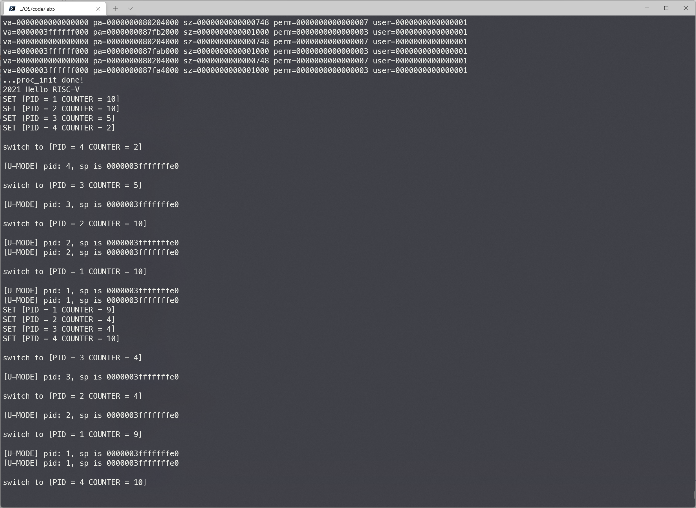

<center>
    姓名: 孟俊邑 <br>
    学号：3190106104 <br>
    学院： 计算机科学与技术学院 <br>
</center>

# Lab 5: RV64 用户模式

## 实验步骤

### 1 准备工程

+ 修改 `vmlinux.lds.S`

```
    .data : ALIGN(0x1000){
        _sdata = .;

        *(.sdata .sdata*)
        *(.data .data.*)
        
        _edata = .;

        . = ALIGN(0x1000);
        uapp_start = .;
        *(.uapp .uapp*)
        uapp_end = .;
        . = ALIGN(0x1000);
        
    } >ramv AT>ram
```

+ 修改 `defs.h`

```c
#define USER_START (0x0000000000000000) // user space start virtual address
#define USER_END   (0x0000004000000000) // user space end virtual address
```

+ 修改**根目录**下的`Makefile`, 将 `user` 纳入工程管理

```makefile
.PHONY:all run debug clean
all:
	${MAKE} -C lib all
	${MAKE} -C init all
	${MAKE} -C user all
	${MAKE} -C arch/riscv all
	@echo -e '\n'Build Finished OK
```

### 2 创建用户态进程

+ 修改`task_init`

```c
/* 线程状态段数据结构 */
struct thread_struct {
    uint64_t ra;
    uint64_t sp;                     
    uint64_t s[12];
    uint64_t sepc, sstatus, sscratch; 
};

/* 线程数据结构 */
struct task_struct {
    struct thread_info* thread_info;
    uint64_t state;
    uint64_t counter;
    uint64_t priority;
    uint64_t pid;
    struct thread_struct thread;
    pagetable_t pgd;
};
for(int i = 1; i < NR_TASKS; i++){
    task[i] = (struct task_struct *)kalloc();
    task[i] -> state = TASK_RUNNING;
    task[i] -> counter = 0;
    task[i] -> priority = rand();
    task[i] -> pid = i;
    task[i] -> thread.ra = (uint64)__dummy;
    task[i] -> thread.sp = (uint64)task[i] + PGSIZE;
    task[i] -> thread.sepc = USER_START;
    // SPP=0 SPIE=1 SUM=1
    task[i] -> thread.sstatus = (csr_read(sstatus)) | (1<<5) | (1<<18) & 0xFFFFFFFFFFFFFEFF;
    task[i] -> thread.sscratch = USER_END;
    // 页表
    pagetable_t pgtbl = (pagetable_t)kalloc(); 
    memcpy(pgtbl, swapper_pg_dir, sizeof(swapper_pg_dir)/sizeof(char));
    // 映射uapp的内容
    create_mapping(pgtbl, 0, U64(uapp_start) - PA2VA_OFFSET, U64(uapp_end) - U64(uapp_start), 7, 1);
    // 映射用户栈
    create_mapping(pgtbl, USER_END - PGSIZE, kalloc() - PA2VA_OFFSET, PGSIZE, 3, 1);
    // 为了简单，这里我们直接把page number存入pgd
    task[i] -> pgd = (pagetable_t) ((U64(pgtbl) - PA2VA_OFFSET) >> 12);
}
```

加入用户线程后`task_struct`有以下几处新增的域：

- `sepc`：`sret`的返回位置，初始设置为`USER_START`
- `sstatus`： 设置 `sstatus` 中的 `SPP`（使得 sret 返回至 U-Mode）， `SPIE`（sret 之后开启中断）， `SUM`（S-Mode 可以访问 User 页面）
- `sscratch`：用于在内核态和用户态切换的过程中保存`sp`，初始设置为`U-Mode`的sp
- `pgd`：每一个进程需要有自己独立的页表，因为uapp段映射到物理内存中的位置不同

```
                PHY_START                                                                PHY_END
                         uapp_start   uapp_end
                   │         │            │                                                 │
                   ▼         ▼            ▼                                                 ▼
       ┌───────────┬─────────┬────────────┬─────────────────────────────────────────────────┐
 PA    │           │         │    uapp    │                                                 │
       └───────────┴─────────┴────────────┴─────────────────────────────────────────────────┘
                             ▲            ▲
       ┌─────────────────────┘            │
       │                                  │
       │            ┌─────────────────────┘
       │            │
       │            │
       ├────────────┼───────────────────────────────────────────────────────────────────┬────────────┐
 VA    │    UAPP    │                                                                   │u mode stack│
       └────────────┴───────────────────────────────────────────────────────────────────┴────────────┘
       ▲                                                                                             ▲
       │                                                                                             │

   USER_START                                                                                    USER_END
```

+  修改 __switch_to， 需要加入 保存/恢复 `sepc` `sstatus` `sscratch` 以及 切换页表的逻辑

```assembly
    .globl __switch_to
__switch_to:
    # a0: prev
    # a1: next
    # 保存当前的状态到thread_struct

    sd ra, 40(a0)
    sd sp, 48(a0)
    sd s0, 56(a0)
    sd s1, 64(a0)
    sd s2, 72(a0)
    sd s3, 80(a0)
    sd s4, 88(a0)
    sd s5, 96(a0)
    sd s6, 104(a0)
    sd s7, 112(a0)
    sd s8, 120(a0)
    sd s9, 128(a0)
    sd s10, 136(a0)
    sd s11, 144(a0)
    csrr t0, sepc
    sd t0, 152(a0)
    csrr t0, sstatus
    sd t0, 160(a0)
    csrr t0, sscratch
    sd t0, 168(a0)

    # 根据thread_struct恢复之前的状态
    ld ra, 40(a1)
    ld sp, 48(a1)
    ld s0, 56(a1)
    ld s1, 64(a1)
    ld s2, 72(a1)
    ld s3, 80(a1)
    ld s4, 88(a1)
    ld s5, 96(a1)
    ld s6, 104(a1)
    ld s7, 112(a1)
    ld s8, 120(a1)
    ld s9, 128(a1)
    ld s10, 136(a1)
    ld s11, 144(a1)
    ld t0, 152(a1)
    csrw sepc, t0
    ld t0, 160(a1)
    csrw sstatus, t0
    ld t0, 168(a1)
    csrw sscratch, t0

    # 切换页表
    ld t0, 176(a1)
    li t1, 0x8000000000000000
    or t0, t0, t1
    csrw satp, t0
    sfence.vma zero, zero
    ret
```

### 3 修改中断入口/返回逻辑 ( _trap ) 以及中断处理函数 （ trap_handler ）

- 由于我们的用户态进程运行在 `U-Mode` 下， 使用的运行栈也是 `U-Mode Stack`， 因此当触发异常时， 我们首先要对栈进行切换 （ `U-Mode Stack` -> `S-Mode Stack` ）。同理 让我们完成了异常处理， 从 `S-Mode` 返回至 `U-Mode`， 也需要进行栈切换 （ `S-Mode Stack` -> `U-Mode Stack` ）

```assembly
_traps:
    # 保存U-mode的sp
    csrrw sp,sscratch,sp
	……………………
    # 返回U-mode
    csrrw sp, sscratch, sp
    sret
```

+ 修改 `__dummy`。在初始化时， `thread_struct.sp` 保存了 `S-Mode sp`， `thread_struct.sscratch` 保存了 `U-Mode sp`， 因此在 `S-Mode -> U->Mode` 的时候，我们只需要交换对应的寄存器的值即可。

```assembly
__dummy:
    // sret回去之后进入了用户态，需要使用用户态的栈
    csrrw sp, sscratch, sp
    sret
```

+ `uapp` 使用 `ecall` 会产生 `ECALL_FROM_U_MODE` **exception**。因此我们需要在 `trap_handler` 里面进行捕获。修改 `trap_handler` 如下：

```c
#include "printk.h"
#include "clock.h"
#include "proc.h"
#include "string.h"
struct pt_regs
{
    unsigned long zero;
	…………………………
    unsigned long t6;
    unsigned long sepc;
};
extern struct task_struct* current;

void trap_handler(unsigned long scause, unsigned long sepc, struct pt_regs * regs) {
    // 通过 `scause` 判断trap类型
    // 如果是interrupt 判断是否是timer interrupt
    // 如果是timer interrupt 则打印输出相关信息, 并通过 `clock_set_next_event()` 设置下一次时钟中断
    // `clock_set_next_event()` 见 4.5 节
    // 其他interrupt / exception 可以直接忽略
    unsigned long int_bit = 0x8000000000000000;
    if(scause & int_bit){
        switch (scause & ~int_bit){
            case 0x5:
                do_timer();
                break;
            default:
                printk("Int scause:%d\n", scause);
                break;
        }
    }else{
        switch (scause){
            case 0x8:
                ECALL_FROM_U_MODE
				………………………………
                break;
            default:
                printk("Exception scause:%d\n", scause);
                regs->sepc+=4;
                break;
        }
    }
}
```

### 4 添加系统调用

+ 系统调用规范

  - 64 号系统调用 `sys_write(unsigned int fd, const char* buf, size_t count)` 该调用将用户态传递的字符串打印到屏幕上，此处fd为标准输出（1），buf为用户需要打印的起始地址，count为字符串长度，返回打印的字符数。( 具体见 user/printf.c )

  - 172 号系统调用 `sys_getpid()` 该调用从current中获取当前的pid放入a0中返回，无参数。（ 具体见 user/getpid.c ）

```c
case 0x8:
    switch (regs->a7){
        case 64:
            if(regs -> a0 == 1){
                char buf[1000] = {0};
                memcpy(buf, (void *)regs -> a1, regs -> a2);
                regs -> a0 = printk(buf);
            }
            break;
        case 172:
            regs -> a0 = current -> pid;
            break;
    }
    regs->sepc+=4;
    break;
```

+ 增加 `syscall.c` `syscall.h` 文件， 并在其中实现 `getpid` 以及 `write` 逻辑

```
#define SYS_WRITE   64
#define SYS_GETPID  172
```

### 5 修改 head.S 以及 start_kernel

- 之前 lab 中， 在 OS boot 之后，我们需要等待一个时间片，才会进行调度。我们现在更改为 OS boot 完成之后立即调度 uapp 运行。
- 在 start_kernel 中调用 schedule() 注意放置在 test() 之前。
- 将 head.S 中 enable interrupt sstatus.SIE 逻辑注释，确保 schedule 过程不受中断影响。

```assembly
_start:
    la sp, boot_stack_top
    call setup_vm
    call relocate
    call mm_init
    call setup_vm_final

    # set stvec = _traps
    la t0, _traps
    csrw stvec, t0
    
    # set sie[STIE] = 1
    csrr t0, sie
    ori t0, t0, 0x20
    csrw sie, t0
    
    # set first time interrupt
    rdtime t0
    li a0, 10000000
    add a0, a0, t0
    li a1, 0
    li a2, 0
    li a3, 0
    li a4, 0
    li a5, 0
    li a6, 0
    li a7, 0
    call sbi_ecall
    call task_init
    call start_kernel
```

```c
#include "printk.h"
#include "defs.h"
#include "sbi.h"
#include "mm.h"
#include "proc.h"

extern void test();

int start_kernel(){
    printk("%d", 2021);
    printk(" Hello RISC-V\n");
    schedule();
    test(); // DO NOT DELETE !!!
	return 0;
}
```

##  编译及测试



